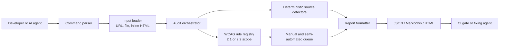
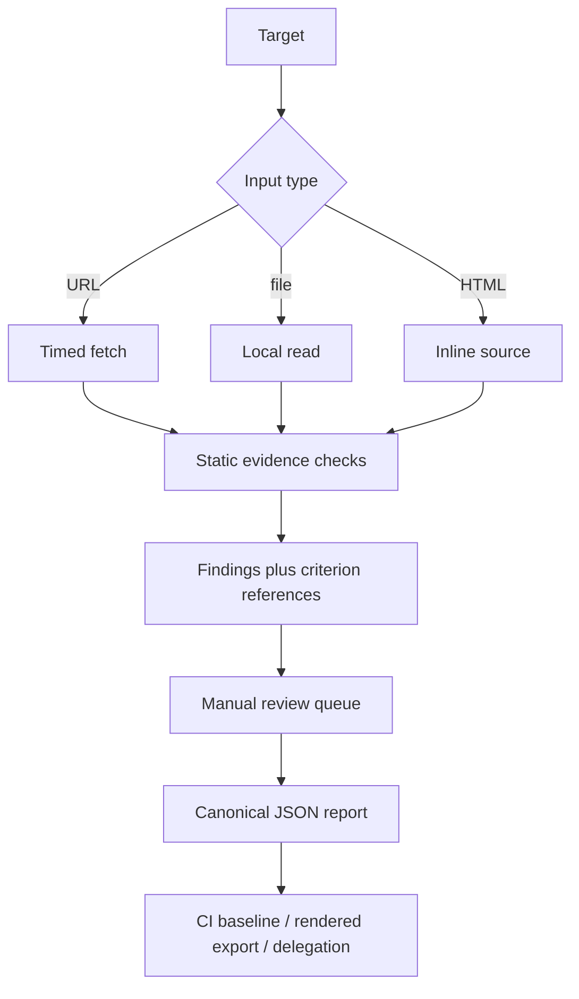
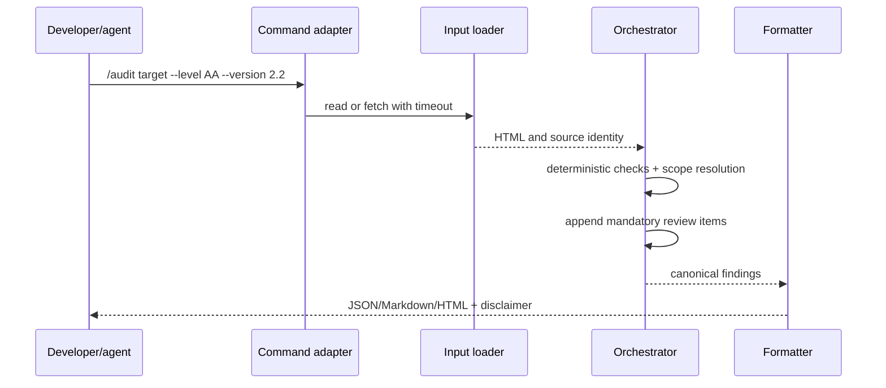
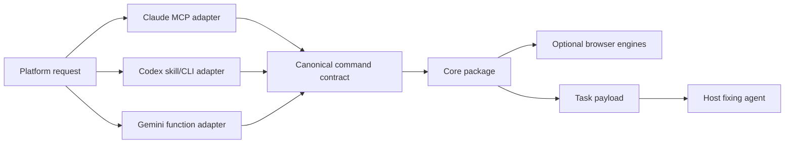

# Architecture

The package is modular and local-first. It does not require a database or a cloud service. A host can add persistence, browser engines, or remote platform adapters at the marked boundaries without changing the canonical report schema.

## Component overview

## Data flow

## Audit sequence

## Platform integration

The adapter must preserve report JSON verbatim, label any external-engine evidence with tool/version, and never erase the manual queue. A critical/high delegation is eligible for automatic task creation; applying a repair remains a host-authorized write.
